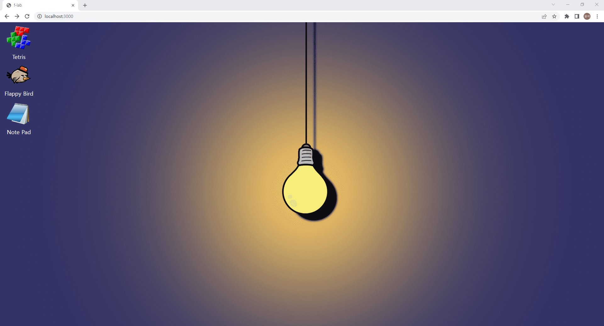

# JavaScript Sandbox

https://f-lab-edu.github.io/js-sandbox/

## 프로젝트 소개



Vanilla JavaScript만을 사용하여 여러가지 기능을 탑재한 데스크탑의 모습을 흉내내는 JavaScript Sandbox SPA 프로젝트입니다.

## 프로젝트 실행방법

```bash
git clone https://github.com/f-lab-edu/js-sandbox.git

npm install

npm run start
```

## Commit Convention

### 1. Commit Message Structure

기본적으로 커밋 메시지는 아래와 같이 제목/본문/꼬리말로 구성한다.

```text
type : subject

body

footer
```

### 2. Commit Type

- feat : 새로운 기능 추가
- fix : 버그 수정
- docs : 문서 수정
- style : 코드 포맷팅, 세미콜론 누락, 코드 변경이 없는 경우
- refactor : 코드 리펙토링
- test : 테스트 코드, 리펙토링 테스트 코드 추가
- chore : 빌드 업무 수정, 패키지 매니저 수정

### 3. Subject

- 제목은 50자를 넘기지 않고, 대문자로 작성하고 마침표를 붙이지 않는다.
- 과거시제를 사용하지 않고 명령어로 작성한다.
    - "Fixed" --> "Fix"
    - "Added" --> "Add"

### 4. Body

- 선택사항이기 때문에 모든 커밋에 본문내용을 작성할 필요는 없다.
- 부연설명이 필요하거나 커밋의 이유를 설명할 경우 작성해준다.
- 72자를 넘기지 않고 제목과 구분되기 위해 한칸을 띄워 작성한다.

### 5. footer

- 선택사항이기 때문에 모든 커밋에 꼬리말을 작성할 필요는 없다.
- issue tracker id를 작성할 때 사용한다.

Reference : [https://doublesprogramming.tistory.com/256](https://doublesprogramming.tistory.com/256)
